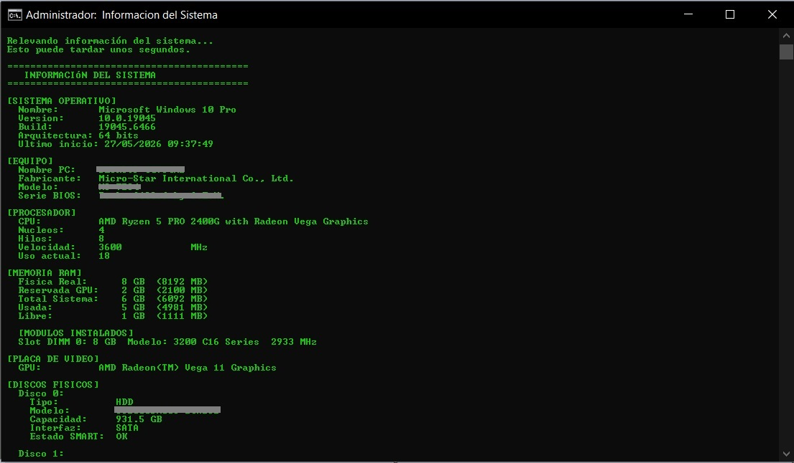
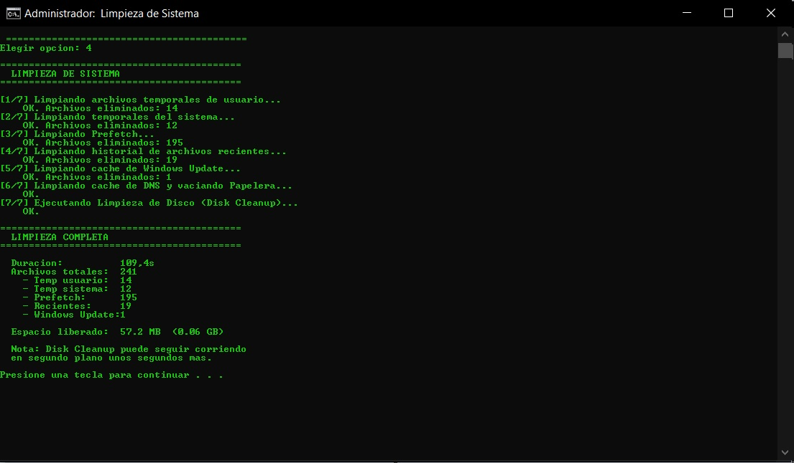
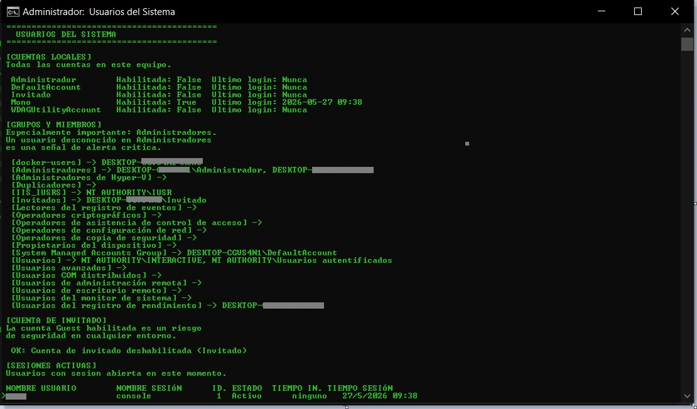
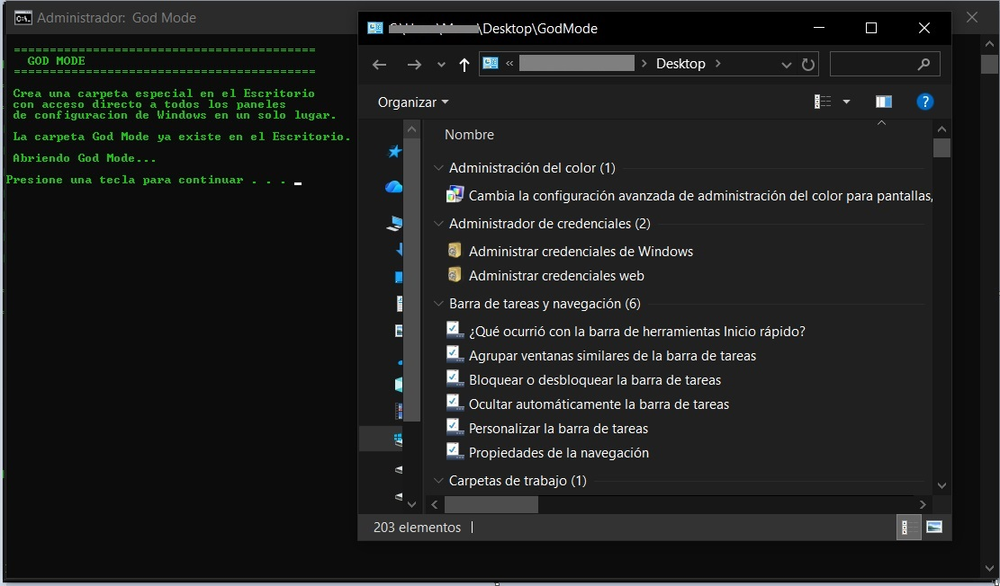

# Portable Windows Toolkit

Toolkit portable desarrollado en Batch y PowerShell para tareas de:

- diagnóstico
- mantenimiento
- reparación
- auditoría básica
- soporte técnico Windows

El proyecto fue diseñado con un enfoque modular y portable,
pensado para asistencia técnica y troubleshooting en entornos Windows.

Actualmente el sistema se encuentra en su Versión 1 (v1.0.0).

---

## 🚀 Tecnologías utilizadas

- Batch (CMD)
- PowerShell
- Git / GitHub

---

## 🧩 Estructura del proyecto

```text
toolkit/
├── menu.bat
├── scripts/
└── logs/
```

La estructura está pensada para facilitar:
 - mantenibilidad
 - modularidad
 - portabilidad
 - escalabilidad futura
---

## ⚡ Uso rápido
1. Clonar o descargar el repositorio
2. Ejecutar `menu.bat` como administrador
3. Seleccionar la opción deseada desde el menú
---

## 🔧 Funcionalidades

### 🖥 Diagnóstico del sistema
- Información general del sistema
- Estado de discos físicos
- Verificación SMART
- Uso de CPU y RAM
- Procesos activos
- Servicios del sistema
- Información de usuarios y sesiones

### 🌐 Red y conectividad
- Reparación de red automática
- Flush DNS
- Reset Winsock
- Reset TCP/IP
- Limpieza de proxy
- Auditoría de conexiones activas
- Análisis de puertos
- Mapa de red local

### 👥 Auditoría y seguridad
- Usuarios locales
- Grupos administrativos
- Sesiones activas
- Procesos sospechosos
- Servicios innecesarios
- Revisión básica de seguridad

### 🧹 Mantenimiento y optimización
- Limpieza de archivos temporales
- Optimización básica del sistema
- Reparaciones comunes Windows
- Generación automática de logs
---

## 📌 Filosofía del proyecto

El proyecto busca no solo automatizar tareas,
sino también explicar y contextualizar las acciones realizadas,
priorizando:

 - claridad
 - diagnóstico 
 - aprendizaje técnico
 - troubleshooting
 - experiencia de uso

Cada módulo intenta ofrecer información entendible tanto para el técnico
como para usuarios con menor conocimiento técnico.
---

## 📄 Reportes y logs
El toolkit genera logs automáticos por módulo ejecutado,
permitiendo:

 - auditoría básica 
 - historial de mantenimiento 
 - análisis posterior
 - generación futura de informes técnicos para clientes

Los logs se almacenan automáticamente dentro de:
/logs
---

## 🔄 Versionado del proyecto

### Versión 1.0.0 (Finalizada)
 - Toolkit modular funcional
 - Menú centralizado
 - Scripts de diagnóstico
 - Scripts de mantenimiento
 - Reparación de red
 - Auditoría básica del sistema
 - Generación de logs automáticos

### Versión 1.1.0 (Actual)
- info_sistema: build detallado con UBR, último inicio legible,
- RAM física real, reserva GPU, detalle por módulo,
- discos con tipo HDD/SSD e interfaz, particiones agrupadas por disco
- limpieza: agrega log con conteo de archivos, duración y espacio liberado
- reparar_red: timestamp via PowerShell, errores de registro suprimidos
- reparar_windows_update: timestamp via PowerShell, errores de registro suprimidos
- reporte_disco: suprimido ruido visual en log de chkdsk, nota de falso positivo
- Timestamp de logs migrado a PowerShell en todos los scripts afectados

### Versión 2.0.0 (Planificada)
Migración de mic a PowerShell
Exportación HTML/PDF
Encoding de net, ipconfig y chkdsk en logs
Informes simplificados para clientes
Detección inteligente de problemas
Mejoras de UX/UI
---

## 🧪 Testing
Las pruebas fueron realizadas manualmente en entornos Windows,
validando:

 - ejecución de scripts
 - generación de logs
 - funcionamiento de módulos
 - reparación de red
 - análisis del sistema
 - auditoría de usuarios
 - detección de procesos y servicios
 - estabilidad general del toolkit
---

## ⚠️ Limitaciones conocidas
- En Windows 10 con PowerShell 5, las rutas de proceso en el reporte de CPU pueden aparecer sin el prefijo `C:\` por limitaciones del encoding en pipes de batch.
- El reporte de disco puede tardar varios minutos en HDDs mecánicos.
---

## 🛡️ Seguridad y Elevación de Privilegios
El toolkit cuenta con un sistema de **auto-elevación de privilegios**.
Al ejecutarse, el script verifica si cuenta con permisos de administrador; de no ser así, solicitará acceso mediante UAC (User Account Control) utilizando PowerShell.

**¿Por qué requiere permisos?**
- Modificación y reparación de interfaces de red (`netsh`).
- Consulta de información de hardware profunda (`wmic` / `CIM`).
- Gestión de servicios críticos del sistema.
- Limpieza de archivos temporales en directorios protegidos.
---

## 🧠 Objetivo del proyecto

Este proyecto fue desarrollado con fines:
 - formativos
 - prácticos
 - profesionales

con el objetivo de consolidar conocimientos en:

 - scripting Windows
 - automatización
 - troubleshooting
 - administración básica de sistemas
 - soporte técnico
 - análisis y diagnóstico de PCs Windows
---

## 📷 Screenshots

### Menú principal


### Información del sistema


### Limpieza de sistema


### Reparación de red


### Usuarios del sistema


### God Mode


---

## 📌 Estado actual

Proyecto en desarrollo activo.
La toolkit continúa evolucionando mediante mejoras progresivas,
refactorización y expansión de funcionalidades.