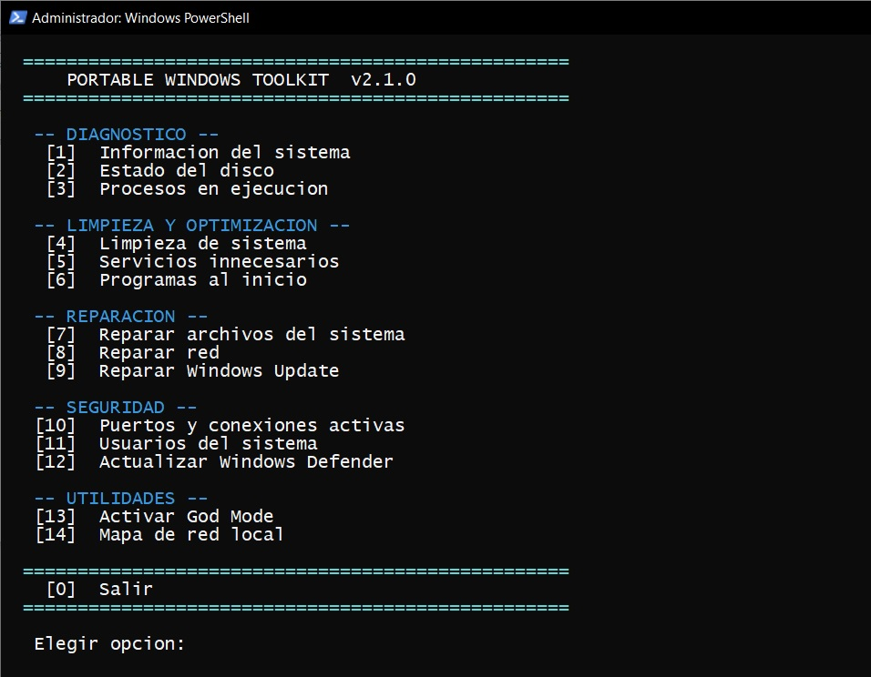
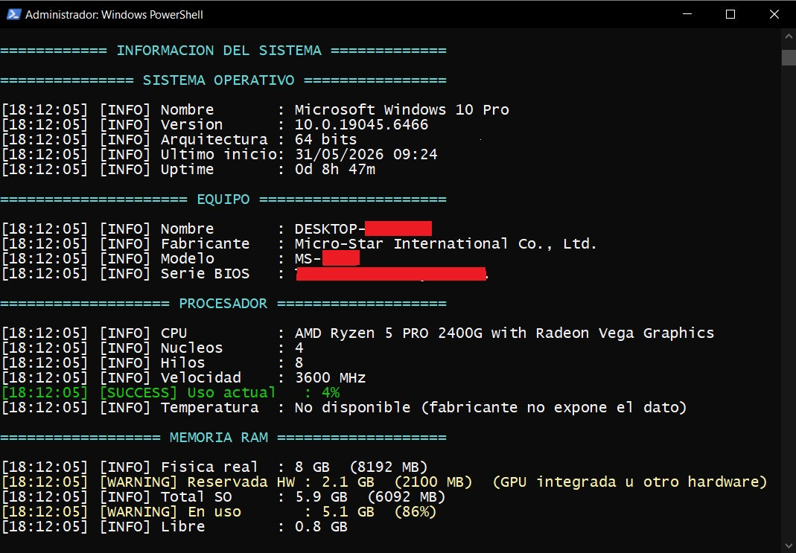
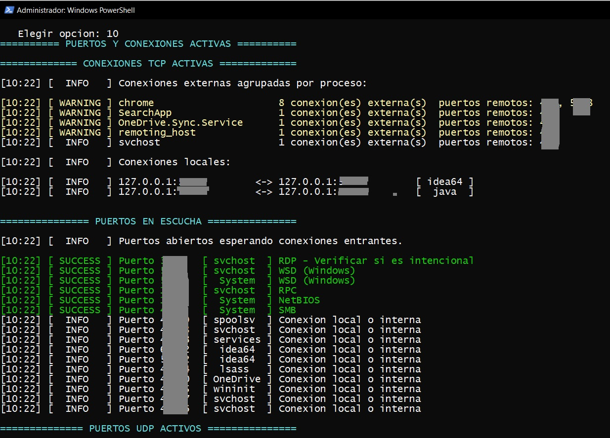
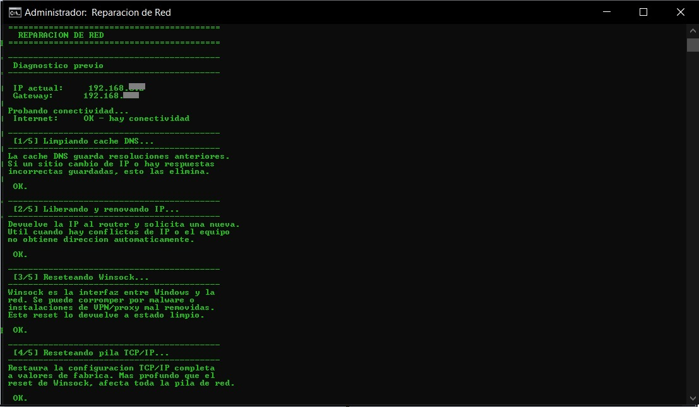

# Portable Windows Toolkit

Toolkit portable desarrollado en PowerShell para tareas de:

- diagnóstico
- mantenimiento
- reparación
- auditoría de seguridad
- soporte técnico Windows

Diseñado con un enfoque modular y portable, 
pensado para asistencia técnica y troubleshooting en entornos Windows.

Actualmente, el sistema se encuentra en su Versión 2 (v2.1.0).

---


## ⚡ Uso rápido
1. Clonar o descargar el repositorio
2. Ejecutar `launcher.bat` como administrador
3. Seleccionar la opción deseada desde el menú

> El launcher solicita elevación UAC automáticamente.
> Todos los módulos corren en la misma ventana de PowerShell.
---

## Funcionalidades

### 🖥 Diagnóstico del sistema
- Información completa de hardware y software
- CPU con temperatura (si el fabricante la expone)
- RAM física real vs disponible para el SO (incluye memoria reservada por GPU integrada)
- Detalle por módulo RAM (slot, modelo, fabricante, velocidad)
- GPU con VRAM, resolución y versión de driver
- Batería con nivel y estado (en notebooks)
- Discos físicos con estado SMART
- Particiones con porcentaje de uso y alertas
- Red: IP, MAC, gateway, DNS
- Servicios críticos: Defender, Firewall, Windows Update
- Diagnostico general con semáforo visual al final
- Estado del disco con chkdsk y top 10 carpetas más pesadas
- Procesos agrupados con clasificación por origen y nivel de riesgo

### 🌐 Red y conectividad
- Reparación de red automática (flush DNS, reset IP, Winsock, TCP/IP, proxy)
- Mapa de red local con escaneo de dispositivos via ping paralelo
- Tabla ARP con dispositivos recientes
- Auditoria de puertos con clasificación de riesgo por puerto y proceso

### 👥 Auditoría y seguridad
- Usuarios locales con último login
- Grupos y miembros (con alerta para Administradores)
- Sesiones activas
- Últimos 10 inicios de sesión del log de seguridad
- Puertos en escucha con detección de puertos de riesgo conocidos
- Conexiones a internet agrupadas por proceso
- Servicios innecesarios (telemetría, Xbox, raramente usados)
- Programas al inicio desde registro, carpetas y Programador de Tareas

### 🧹 Mantenimiento y optimización
- Limpieza de temporales (usuario, sistema, recientes, cache WU)
- Limpieza de Prefetch opcional con explicación del impacto
- Flush DNS y vaciado de papelera
- Disk Cleanup automatizado
- Conteo de items eliminados y espacio liberado

### Reparación
- SFC y DISM con progreso en tiempo real y tiempo transcurrido
- Reparación de Windows Update (servicios, cache, registro, DLLs)
- Reparación de red con díagnostico antes y después

### Utilidades
- God Mode en el Escritorio
- Actualización de Windows Defender con escaneo rápido y completo opcionales

---

## Screenshots

<table>
  <tr>
    <td align="center">
      <a href="img/menu.jpg"></a>
      <br/><sub>Menu principal</sub>
    </td>
    <td align="center">
      <a href="img/info_sistema.jpg"></a>
      <br/><sub>Informacion del sistema y diagnostico</sub>
    </td>
  </tr>
  <tr>
    <td align="center">
      <a href="img/puertos.jpg"></a>
      <br/><sub>Puertos y conexiones activas</sub>
    </td>
    <td align="center">
      <a href="img/reparacion_red.jpg"></a>
      <br/><sub>Reparacion de red</sub>
    </td>
  </tr>
</table>

---
## Arquitectura del proyecto

### Estructura 

```text
toolkit/
|-- launcher.bat
|-- menu.ps1
|-- lib/
|   `-- Utils.ps1
|-- scripts/
|   |-- defender.ps1
|   |-- godmode.ps1
|   |-- info_sistema.ps1
|   |-- mapa_red.ps1
|   |-- limpieza.ps1
|   |-- procesos.ps1
|   |-- puertos.ps1
|   |-- reparar_red.ps1
|   |-- reparar_sistema.ps1
|   |-- reparar_windows_update.ps1
|   |-- reporte_disco.ps1
|   |-- servicios.ps1
|   |-- startup.ps1
|   `-- usuarios.ps1
`-- logs/
```
La estructura está pensada para facilitar:
- mantenibilidad
- modularidad
- portabilidad
- escalabilidad futura

### lib/Utils.ps1
Modulo compartido importado via dot-sourcing por todos los scripts.
Provee: `Write-Log`, `Write-Blank`, `Write-Section`, `Initialize-Environment`,
`Test-IsAdmin`, `Invoke-Elevate`, `Format-Bytes`, `Invoke-Pause`.

### launcher.bat
Unico archivo `.bat` del proyecto. Su unico trabajo es elevar PowerShell
y lanzar `menu.ps1`. Toda la logica vive en los scripts `.ps1`.

### Plantilla de modúlo
Cada script sigue la misma estructura:
```
SYNOPSIS / DESCRIPTION / NOTES
PARAMETROS      ($LogDir, $NoElevation)
IMPORTS         (dot-sourcing de Utils.ps1)
AUTO-ELEVACION
INICIALIZACION  (Initialize-Environment)
DATOS           (Get-CimInstance, etc. - separado de la presentacion)
LOGICA/PRESENTACION
RESUMEN
```


---

## Compatibilidad

- Windows 10 / 11
- PowerShell 5.1 (incluido en Windows por defecto)
- PowerShell 7+ (usa funcionalidades mejoradas cuando está disponible,
  como ForEach-Object -Parallel en mapa_red.ps1)

---

## Seguridad y Elevación de Privilegios
El toolkit cuenta con un sistema de **auto-elevación de privilegios**.
Al ejecutarse, el script verifica si cuenta con permisos de administrador; de no ser así, solicitará acceso mediante UAC (User Account Control) utilizando PowerShell.

**¿Por qué requiere permisos?**
- Modificación y reparación de interfaces de red (`netsh`).
- Consulta de información de hardware profunda (`wmic` / `CIM`).
- Gestión de servicios críticos del sistema.
- Limpieza de archivos temporales en directorios protegidos.
---

## Logs

Cada modúlo genera un log automatico en `/logs` con timestamp:
```
logs/
|-- info_sistema_2026-05-31_10-57.txt
|-- reporte_disco_2026-05-31_09-50.txt
`-- ...
```

El log contiene el mismo output que la consola, sin colores ANSI.

---

## Limitaciones conocidas
- La temperatura de CPU depende de que el fabricante exponga el dato
  via `MSAcpi_ThermalZoneTemperature`. En algunos equipos no está disponible.
- El conteo de espacio liberado en limpieza no incluye Disk Cleanup,
  ya que corre en segundo plano de forma asíncrona.
- El escaneo de red (mapa_red) puede no detectar dispositivos que
  bloquean ICMP (ping) en firewall.
- Los eventos de seguridad en `usuarios.ps1` requieren que la auditoria
  de inicio de sesión está habilitada en el sistema.

---

## Testing
Las pruebas fueron realizadas manualmente en entornos Windows 10 Pro,
y en Windows 11 validando:

- ejecución y funcionamiento de cada modúlo
- generación de logs
- análisis completo del sistema
- reparación de red y sistema
- auditoría de usuarios
- detección de procesos y servicios
- clasificación de riesgo en puertos y procesos
- estabilidad general del toolkit
---

## Versionado

### Versión 1.0.0 (Finalizada)
 - Toolkit modular funcional
 - Menú centralizado
 - Scripts de diagnóstico
 - Scripts de mantenimiento
 - Reparación de red
 - Auditoría básica del sistema
 - Generación de logs automáticos

### Versión 1.1.0 (Finalizada)
- info_sistema: build detallado con UBR, último inicio legible,
- RAM física real, reserva GPU, detalle por módulo,
- discos con tipo HDD/SSD e interfaz, particiones agrupadas por disco
- limpieza: agrega log con conteo de archivos, duración y espacio liberado
- reparar_red: timestamp via PowerShell, errores de registro suprimidos
- reparar_windows_update: timestamp via PowerShell, errores de registro suprimidos
- reporte_disco: suprimido ruido visual en log de chkdsk, nota de falso positivo
- Timestamp de logs migrado a PowerShell en todos los scripts afectados
- Supresión de ruido visual en logs de chkdsk y reparaciones

### Versión 2.0.0 (Actual)
- Migración completa a PowerShell nativo (eliminación de Batch)
- Modúlo compartido lib/Utils.ps1 con logging por niveles y colores
- Plantilla uniforme para todos los modulos
- Clasificación de riesgo en puertos (por puerto, proceso e IP)
- Clasificación de procesos por origen (sistema, aplicación, desconocido)
- RAM física real vs reservada por hardware
- Temperatura de CPU, VRAM, driver GPU, batería
- Diagnostico general con semáforo visual
- Uptime legible
- Detección automática de PS 5.1 vs. PS 7+ para optimización
- Prefetch con advertencia y confirmación opcional
- Progreso en tiempo real para SFC, DISM y chkdsk

### Versión 2.1.0 (Actual)
- Revisión completa de formato y consistencia visual de reportes
- Incorporación de etiquetas NOTE en todos los módulos
- Centralización de validación de conectividad mediante Test-InternetConnection()
- Optimización y reducción de ruido visual en logs
- Diagnóstico de sistema reorganizado para lectura rápida
- Eliminación de métricas de temperatura no confiables
- Incorporación de información detallada de placa madre
- Incorporación de versión y fecha de BIOS
- Diagnóstico general unificado y estandarizado
- Mejoras en alineación visual de reportes
- Corrección de inconsistencias entre módulos
- Mejora general de mantenibilidad y experiencia de soporte técnico

### Versión 2.2.0 (Planificada)
- Exportación estructurada de reportes en JSON
- Generación de reportes HTML
- Generación de reportes PDF
- Consolidación automática de múltiples reportes en un informe único
- Identificación de fabricante por MAC (OUI Lookup) en mapa_red
- Escaneo completo de Windows Defender
- Mejoras de encoding para salida de herramientas nativas
- Distinción entre DLL inexistente y DLL con error de registro en reparar_windows_update
- Detección de IP APIPA (169.254.x.x)
- Manejo mejorado de unidades removibles en reporte_disco
- Forzar InvariantCulture en valores numéricos
- Expansión de lista blanca de procesos conocidos

### Versión 3.0.0 (Visión futura)
- Motor de consolidación de auditorías
- Informe técnico completo basado en JSON
- Informe simplificado orientado al cliente
- Sistema de recomendaciones automáticas
- Evaluación integral de estado del equipo
- Generación de informes profesionales para entrega post-servicio

---

## Objetivo del proyecto

Este proyecto fue desarrollado con fines:
 - formativos
 - prácticos
 - profesionales

con el objetivo de consolidar conocimientos en:

 - scripting Windows
 - automatización
 - troubleshooting
 - administración básica de sistemas
 - soporte técnico
 - análisis y diagnóstico de PCs Windows

---

## Estado actual

Version 2.1.0 finalizada.
El proyecto continúa evolucionando mediante mejoras progresivas,
refactorización y expansión de funcionalidades.